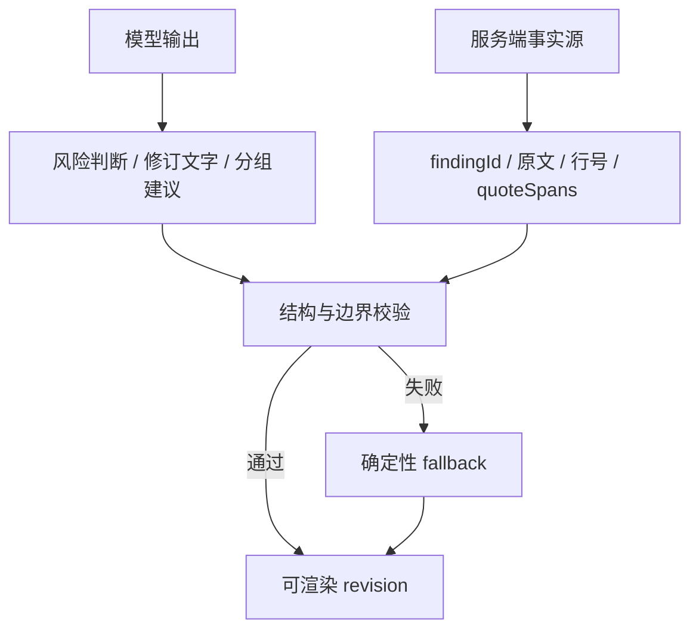

<div align="center">


# 法飞飞 AI · 商业合同智能审查

**面向企业经营者、法务、律师与商务人员的多 Agent 合同风险审查和精细化批注系统**

[](https://react.dev/)
[](https://vite.dev/)
[](https://nodejs.org/)
[](https://expressjs.com/)
[](https://sqlite.org/fts5.html)
[](#许可证)

[在线站点](https://www.flylegal.cn/) · [快速开始](#快速开始) · [系统架构](#系统架构) · [API](#api-接口) · [部署](#生产部署)

</div>

> [!IMPORTANT]
> 本项目输出用于辅助识别合同风险和完善条款，不构成正式法律意见。签署、重大金额、强监管或争议项目应结合完整交易事实，由专业人士复核。

## 项目简介

法飞飞 AI 当前包括品牌官网和登录后的多工具工作台：

- **品牌官网**：产品矩阵、行业解决方案、客户案例、团队介绍与咨询入口；
- **商业合同审查工作台**：上传合同后，依次完成文件解析、结构分析、知识检索、三轮风险审查、问题归并、条款修订和局部批注展示。
- **合同起草、用工咨询、劳动合同/劳务派遣分析及劳动仲裁答辩**：复用鉴权、任务、解析与工作台组件，各产品保留独立业务流程；员工手册、计算器等通用工具页的样式接入不代表相应业务工作流已实现。

2026-10-05交付更新以当前磁盘代码和本地Git为依据：用户确认本次从PR #7合并点4f14e90开始，核心是劳动合同/派遣与仲裁；已有咨询/知识库等提交另列，不仅按未提交修改界定范围。开发自测与用户试用记录已具备，带教/公司法务在代码交付后复核，发布环境尚未验收。README说明机制，HANDOFF记录交付状态；总PR稿位于仓库外 `../../docs/法飞飞本次PR整合说明-20261004.md`（已补10月5日修订），不会自动随Git交付，PR页面需包含其详细正文。2026-10-05提交批次已获用户授权；通过GitHub API和Git fetch核对目标main，其HEAD为PR #7合并点4f14e90。本次详细说明直接写入带教仓库PR描述，最终提交与PR状态以Git/GitHub为准；提交不等于部署。

合同审查不是一次简单的“把整段交给大模型重写”。系统将模型能力和代码级约束结合：模型负责理解、判断和起草，服务端负责原文定位、跨轮去重、ID 完整性、修订边界和安全回退。最终输出的正文标记与修订卡片按编号一一对应，完整条款默认折叠，便于审阅长合同。

## 核心能力

| 能力 | 说明 |
| --- | --- |
| 多格式文件解析 | 支持 PDF、DOC、DOCX、PNG、JPG、JPEG、WebP；图片通过 OCR 提取文字 |
| 模型模式 | 两模式共用 `deepseek-flash`；思考开关、强度和预算由各工具阶段决定，具体差异见环境变量下的模式表 |
| 三轮增量审查 | 后一轮基于前轮结果补充遗漏，并实时展示每轮新增问题 |
| 双层问题去重 | 提示词约束 + 代码级语义与定位相似度判断，降低换标题、换措辞造成的重复 |
| 混合知识检索 | SQLite FTS5/BM25 为默认检索，可选 Qdrant 向量召回与 SiliconFlow 重排 |
| 可追溯原文定位 | 模型提供最小问题摘录，服务端映射为可信行号与字符区间；定位失败时不猜测 |
| 第四归并 Agent | 三轮审查后按“重复、相关、独立”汇总问题，服务端校验全覆盖、唯一性和目标兼容性 |
| 外科手术式修订 | Agent 同时输出完整修订条款和 `localizedEdits`，页面只标记真正发生变化的局部片段 |
| 编号就近批注 | 正文浅橙标记、编号和对应修订卡一一关联，完整说明和整条修订默认收起 |
| 确定性安全回退 | Agent 输出缺失、越界或不合规时，回退到已验证的 finding 与 quote span，不让错误锚点进入页面 |
| Word 导出 | 导出的 `.doc` 延续页面编号、局部高亮和就近批注结构 |
| 多会话并行 | 每个对话独立维护请求状态；审查在后台任务中继续执行，用户可切换或新建会话同时发起其他请求 |
| 生成中停止与插队 | 发送与停止共用同一按钮：空闲发送、生成中空输入停止、生成中已有输入则停止上一轮并立即发送；半截内容标记为未完成并进入下一轮上下文 |
| 按任务恢复 | 刷新或重新打开历史对话时，按关联的 `taskId` 恢复排队、运行、取消、失败与成功状态，不依赖页面内存 |
| 本地历史记录 | 对话、审查任务和结构化修订结果保存在浏览器本地存储中，服务端任务结果为权威事实源 |

## 审查工作流


### 数据可信边界

系统把“模型建议”和“服务端可信事实”分开处理：



主要结构化对象：

- `finding`：风险等级、标题、位置、原文、最小问题子句、字符区间、风险与建议；
- `revision group`：需要在同一修改目标中共同处理的一个或多个 finding；
- `localized edit`：`replace`、`delete` 或 `insert-after` 类型的最小局部编辑；
- `revision`：完整修订条款、局部编辑数组、说明及服务端定位字段。

## 技术栈

| 层级 | 技术 |
| --- | --- |
| Web | React 18、React Router、React Markdown、Lucide React、Framer Motion |
| 构建 | Vite 5、PostCSS、原生 CSS 响应式布局 |
| API | Node.js、Express、Multer、Server-Sent Events |
| 文件解析 | Mammoth、pdf-parse、Tesseract.js、macOS `textutil` / Linux LibreOffice |
| 模型 | OpenAI-compatible Chat Completions 接口；当前模型封装固定返回 `deepseek-flash`，各工作流设置思考参数 |
| 本地知识库 | SQLite、FTS5、条款切分、风险规则抽取、BM25 召回与 RRF 融合 |
| 可选 RAG | Qdrant、BAAI/bge-m3 Embedding、BAAI/bge-reranker-v2-m3 |
| 测试 | Node `assert` 回归脚本、Vite 生产构建、真实浏览器端到端验收 |

## 目录结构

```text
infimind-react/
├── public/                         # 品牌图片、客户 Logo、视频和二维码
├── src/
│   ├── components/                 # 官网展示组件
│   ├── pages/
│   │   ├── HomePage.jsx            # 品牌首页
│   │   ├── AboutPage.jsx           # 关于页面
│   │   └── ContractRewritePage.jsx # 合同审查对话、批注稿、Word 导出
│   ├── utils/                       # 会话请求状态等前端纯函数
│   ├── App.jsx                     # 路由与全局弹窗
│   └── main.jsx                    # React 入口
├── server/
│   ├── agents/                     # 分析、审查、归并、修订 Agent
│   ├── prompts/                    # 四个 Agent 的协议化提示词
│   ├── workflows/                  # 审查、起草、咨询、劳动合同/派遣、仲裁的独立任务工作流
│   ├── routes/                     # 合同审查、起草、任务、知识库与账户 API
│   ├── services/                   # 定位、去重、RAG、任务、队列、检查点、解析与修订合并
│   ├── scripts/                    # 模板导入、知识库评测、任务与归并回归测试
│   ├── knowledge-base/             # SQLite 数据库、索引及文本模板
│   ├── worker.js                   # 独立任务 Worker 入口
│   └── index.js                    # Express 服务入口
├── docs/                           # 产品、架构和部署文档
├── docker-compose.rag.yml          # 可选 Qdrant 服务
├── vite.config.js                  # Vite 与 /api 开发代理
├── .env.example                    # 环境变量模板
└── package.json                    # 脚本与依赖
```

## 快速开始

### 环境要求

- Node.js **24**（仓库提供 `.nvmrc`；Node 22 也可重新安装依赖后运行）
- npm 11+
- macOS、Linux 或 Windows
- 解析旧版 `.doc` 时：
  - macOS 使用系统自带 `textutil`；
  - Linux / Windows 需要可调用的 LibreOffice；Windows 支持 `LIBREOFFICE_BIN`、`LIBREOFFICE_HOME` 和常见安装路径。Word 原生批注提取优先依赖 LibreOffice；页面导出的 HTML 格式 `.doc` 直接解析。
- 使用向量检索时需要 Docker 与 Docker Compose。

> [!WARNING]
> `better-sqlite3` 是原生模块。切换 Node 大版本后必须重新安装或重编译依赖，否则会出现 `NODE_MODULE_VERSION` 不一致。推荐始终先执行 `nvm use` 再安装依赖。

### 1. 获取代码并安装依赖

```bash
git clone git@github.com:spaceyzx216/infimind-react.git
cd infimind-react

nvm install
nvm use
npm ci
```

如果不使用 nvm，请确认 `node -v` 输出 `v24.x`。

### 2. 配置环境变量

```bash
cp .env.example .env.local
```

最小可运行配置：

```dotenv
LOCAL_SERVER_PORT=8789
# 本地无 Redis 时自动使用 SQLite 持久化队列；配置 REDIS_URL 后使用 BullMQ
TASK_QUEUE_MODE=auto
REDIS_URL=
TASK_RUN_WORKER=true
TASK_WORKER_CONCURRENCY=1
TASK_FAKE_LLM=true
DEEPSEEK_API_KEY=your_api_key
DEEPSEEK_BASE_URL=https://api.deepseek.com
TASK_SOURCE_RETENTION_DAYS=90
TASK_SESSION_RETENTION_DAYS=365
JWT_SECRET=replace_with_a_random_32_byte_or_longer_secret
```

`.env.local` 已被 Git 忽略，禁止提交真实密钥。
本地只验证任务平台而没有模型 Key 时，可把 `TASK_FAKE_LLM=true`；该模式不调用真实模型，仅返回确定性示例结果。
实际模型试用须设 `TASK_FAKE_LLM=false` 并配置有效 Key；余额查询仍访问服务端配置 Key 的模型账户，Fake LLM 不会模拟余额。`DEEPSEEK_MODEL` / `DEEPSEEK_FLASH_MODEL` 已不参与当前封装的模型选择，无须设置。现有 `.env.example` 仍有旧模型和旧留存变量，本轮按授权未修改环境文件；从模板复制后请采用上面及下表的有效配置，勿把旧变量当作生效开关。

### 3. 启动前后端

打开两个终端：

```bash
# Terminal 1：Express API，默认 http://localhost:8789
npm run server

# Terminal 2：Vite Web
npm run dev
```

访问：

- 官网：<http://localhost:5173/>
- 合同审查：<http://localhost:5173/contract-rewrite>
- 劳动合同与派遣：<http://localhost:5173/tools/labor-contract>
- 仲裁答辩：<http://localhost:5173/tools/arbitration>
- 健康检查：<http://localhost:8789/api/health>

Vite 会把 `/api` 代理到 `LOCAL_SERVER_PORT`，前后端端口必须保持一致。

## 环境变量

### 基础模型与服务

| 变量 | 必需 | 默认值 | 用途 |
| --- | --- | --- | --- |
| `LOCAL_SERVER_PORT` | 否 | `8789` | Express 监听端口，同时供 Vite 开发代理使用 |
| `DEEPSEEK_API_KEY` | 是 | — | 模型调用和账户余额查询密钥，仅服务端读取 |
| `DEEPSEEK_BASE_URL` | 否 | `https://api.deepseek.com` | OpenAI-compatible API 根地址 |
| `DEEPSEEK_MODEL` / `DEEPSEEK_FLASH_MODEL` | 否 | 已忽略 | 兼容旧配置文件；`llm-client` 的 `getProModel()` / `getFlashModel()` 都返回 `deepseek-flash`。个别函数可传显式 `model` 参数，这不等于环境变量生效 |
| `BUSINESS_DB_PATH` | 否 | `server/data/app.db` | 业务 SQLite 路径；API 与独立 Worker 必须使用同一数据库，隔离测试使用内存库或专用临时库 |
| `LIBREOFFICE_BIN` / `LIBREOFFICE_HOME` | 否 | 自动探测 | 旧 Word / Office 转换的可执行文件或安装根目录；每次转换使用独立临时用户配置，避免占用桌面进程 |
| `JWT_SECRET` | 是 | — | 至少 32 字节的随机密钥，用于签发和校验 15 分钟业务 JWT；只能保存在服务端环境变量或 `.env.local` |
| `JWT_ISSUER` | 否 | `fafee-api` | JWT 签发方校验值 |
| `JWT_AUDIENCE` | 否 | `fafee-web` | JWT 受众校验值 |
| `AUTH_ALLOWED_ORIGINS` | 否 | 空 | 生产环境可写刷新 Cookie 的额外浏览器 Origin，逗号分隔 |
| `TASK_QUEUE_MODE` | 否 | `auto` | `auto` / `local` / `bullmq`；自动模式在有 `REDIS_URL` 时启用 BullMQ |
| `REDIS_URL` | 否 | 空 | Redis 连接地址，例如 `redis://127.0.0.1:6379`；未配置时使用 SQLite 队列 |
| `TASK_RUN_WORKER` | 否 | `true` | API 进程是否同时启动 Worker；生产可在 API 进程设为 `false`，单独运行 `npm run worker` |
| `TASK_WORKER_CONCURRENCY` | 否 | `1` | Worker 并发任务数，需结合模型额度与机器资源提升 |
| `TASK_MAX_ATTEMPTS` | 否 | `3` | 暂时性上游异常的最大尝试次数 |
| `TASK_SESSION_RETENTION_DAYS` | 否 | `365` | 任务平台会话、结果和正文快照按同用户、同产品、同会话最近有效提交计算保存期；阅读、材料停用和队列创建失败不续期 |
| `TASK_SOURCE_RETENTION_DAYS` | 否 | `90` | 新上传原件自上传起保存的天数；历史文件已有更早的清理时间时沿用较早时间，已清理材料不能恢复。旧 `TASK_RESULT_RETENTION_DAYS` / `TASK_FILE_RETENTION_HOURS` 已由这两个配置替代 |
| `TASK_UPLOAD_ROOT` | 否 | `系统临时目录/fafee-task-files` | 任务文件私有临时目录；生产建议配置独立私有挂载点 |
| `TASK_FAKE_LLM` | 否 | `false` | 本地任务平台验收时启用确定性 Fake LLM，不调用真实模型 |

### 模型模式、阶段与重试的实际关系

`llm-client` 未收到 `thinking.type=disabled` 时默认启用思考，未传强度时为 `high`。封装提供 `chatDetailed`（正文、完成原因及用量）、流式 `usage`、JSON 对象输出、取消和超时；默认建连请求及流空闲期限为60秒，调用方可传单次请求总期限，不能把所有阶段写成同一个预算。

| 工具 / 阶段 | 当前行为 |
| --- | --- |
| 劳动合同 / 派遣 | 快速关闭思考；深度仅审查、最终核对开启 `low`，筛选、评分、归并、依赖判断与修订使用快速。工作单元120/240秒，最多三次尝试，底层 `maxAttempts:1`，耗尽后不再由任务层重跑整轮 |
| 仲裁 v2 | 快速关闭思考，深度为 `high`；普通阶段输出16,384/32,768 token，独立复核4,096/8,192；请求180/300秒。底层 `maxAttempts:1`，暂态失败交任务队列，结构/一致性失败每阶段只修补一次 |
| 合同起草 | 意图判断、类型识别、完整生成及 SSE 对话按模式关闭/开启 `low`；完整生成和 SSE 回答传120/240秒，其它分类调用沿用封装默认期限 |
| 商业合同审查 | 结构分析、三轮审查未显式传思考开关，沿用封装默认 enabled/high；因此当前快速选项不代表主 Agent 全程关闭思考。归并/修订新增可选参数以支持劳动工作流，原调用继续兼容 |
| 用工咨询 | 主回答两种模式均 enabled，强度为 fast=`high`、thinking=`max`；标题提炼和查询改写单独禁用思考。这是既有行为，不能因共用输入按钮而写成全部统一 |

单次上下文与累计用量分别记录：仲裁 `contextUsage.promptTokens` 是最近阶段单次输入，`usage` / 阶段用量是多次调用累计；公共控件优先使用前者，旧工具回退原 `prompt_tokens`，没有实际用量时仅作估算（不含本轮附件及检索）。界面1M容量来自当前代码常量，不是所有工具每次都读取1M，也不是供应商额度承诺。

### 可选混合 RAG

| 变量 | 默认值 | 用途 |
| --- | --- | --- |
| `RAG_VECTOR_URL` | 空 | Qdrant 地址，例如 `http://localhost:6333`；空值时退化为纯词法检索 |
| `RAG_VECTOR_API_KEY` | 空 | Qdrant API Key |
| `RAG_VECTOR_COLLECTION` | `contract_knowledge_evidence` | 向量集合名 |
| `SILICONFLOW_API_KEY` | 空 | 默认 Embedding 与 Reranker 服务密钥 |
| `RAG_EMBEDDING_URL` | SiliconFlow Embeddings API | 自定义 Embedding 接口 |
| `RAG_EMBEDDING_API_KEY` | 复用 `SILICONFLOW_API_KEY` | 独立 Embedding 密钥 |
| `RAG_EMBEDDING_MODEL` | `BAAI/bge-m3` | Embedding 模型 |
| `RAG_VECTOR_REBUILD_ON_IMPORT` | `false` | 导入模板时是否删除并重建 Qdrant 集合 |
| `RAG_RERANKER_MODE` | `siliconflow` | `siliconflow` 或 `heuristic` |
| `RAG_RERANKER_URL` | SiliconFlow Reranker API | 自定义重排接口 |
| `RAG_RERANKER_API_KEY` | 复用 `SILICONFLOW_API_KEY` | 独立重排密钥 |
| `RAG_RERANKER_MODEL` | `BAAI/bge-reranker-v2-m3` | 重排模型 |
| `RAG_WHOLE_TEMPLATE` | 启用（只要不是 `off`） | 审查时是否额外注入 1 份同类型完整范本作结构参照；设 `off` 回退为「仅证据」交付。见下文「交付形态：证据通道 + 范本通道」 |

## 知识库与 RAG

### 默认模式：SQLite FTS5

仓库内置 `server/knowledge-base/templates.db`。服务启动时会初始化数据库并加载索引；即使没有 Qdrant 或 SiliconFlow 配置，仍可通过 FTS5/BM25 检索条款和风险规则。

检查状态：

```bash
curl http://localhost:8789/api/knowledge-base/status
```

### 可选模式：Qdrant 混合检索

```bash
docker compose -f docker-compose.rag.yml up -d
```

在 `.env.local` 中配置：

```dotenv
RAG_VECTOR_URL=http://localhost:6333
SILICONFLOW_API_KEY=your_siliconflow_key
RAG_VECTOR_REBUILD_ON_IMPORT=true
```

重新导入素材并同步向量索引：

```bash
npm run import:templates -- "/absolute/path/to/contracts"
```

> [!CAUTION]
> `import:templates` 会把指定素材目录作为权威来源，重建 SQLite 模板、条款、风险规则、评测集和索引文件。请先确认素材目录完整，并备份现有知识库。

运行离线检索评测：

```bash
npm run evaluate:knowledge-base
```

评测报告写入 `server/knowledge-base/evaluation-report.json`，该文件默认不提交。

2026-09-22 的 41 例基线记录为：最终层类别召回 `0.6593`、精度 `0.7187`、类型错配率 `0`、空交付率 `0`；双通道全链路评测的引用率由 `0.4674` 提升到 `0.6122`。使用 `RAG_VECTOR_URL` 时，评测门禁会在 Qdrant 不可达或发生静默降级时失败，不会把降级结果当成同一口径的 hybrid 基线。

### 交付形态：证据通道 + 范本通道（2026-09-22）

审查时除 12 条检索证据外，还会注入 1 份**同类型的完整好合同**作结构参照——取自交付证据中得分最高的正向模板（`knowledge-base.getWholeTemplateForReview`，workflow 的 `knowledge` 阶段选择，透传 3 轮审查与复核）。两个通道严格分离：

- **证据通道**：12 条检索证据，计入类别召回/精度（41 例基线 `0.6593` / `0.7187`）
- **范本通道**：整份范本，只回答「本合同该有哪些条款、结构是否有缺失」，**不计入证据精度、不得作为 `evidence` 编号引用**（Agent 2 提示词规则 9 明确约束）

41 例实测：合并召回（证据 ∪ 范本类别）`0.8028`；全量 e2e A/B 证据利用率 `7.85/12 → 11.83/12`、引用率 `46.7% → 61.2%`，批注数与等级分布持平。`RAG_WHOLE_TEMPLATE=off` 可整体回退。

⚠️ 评测报告里 `layers.final` **只统计证据条**，范本单独记在 `wholeTemplateChannel` —— **评测数字不等于生产实际交给模型的上下文量**，两者要看不同字段。

⚠️ 评测用例（`evaluation_cases`）是 `import:templates` 导入坏例时**自动生成**的副产物（每份坏例一条，期望类别 = 该文档风险规则的类别去重），且重建知识库会 `DELETE FROM evaluation_cases`。人工确认过的金标必须存放在数据库之外，重建后按 `template_id` 回灌。

## API 接口

| 方法 | 路径 | 类型 | 说明 |
| --- | --- | --- | --- |
| `GET` | `/api/health` | JSON | 服务健康检查 |
| `POST` | `/api/auth/register` | JSON | 使用一次性邀请码注册用户名、邮箱和密码 |
| `POST` | `/api/auth/login` | JSON | 使用用户名或邮箱登录，返回 15 分钟 JWT，并写入 7 天 HttpOnly 刷新 Cookie |
| `POST` | `/api/auth/refresh` | JSON | 使用刷新 Cookie 换取新的 JWT，不延长 7 天绝对期限 |
| `GET` | `/api/auth/me` | JSON | 使用 `Authorization: Bearer <JWT>` 查询当前登录用户 |
| `POST` | `/api/auth/logout` | JSON | 撤销刷新令牌并清理 Cookie；已签发 JWT 会在到期前自然失效 |
| `GET` | `/api/account/balance` | JSON | 从服务端查询当前模型账户余额 |
| `GET` | `/api/knowledge-base/templates` | JSON | 返回可参与检索的模板元数据，不返回合同正文 |
| `GET` | `/api/knowledge-base/status` | JSON | 返回文档、条款、风险规则、向量与重排器状态 |
| `POST` | `/api/contract-chat` | SSE | 无附件的合同相关追问对话 |
| `POST` | `/api/contract-rewrite` | SSE | 上传合同并执行完整审查与修订流水线 |
| `POST` | `/api/tasks/contract-review` | `202` JSON | 创建商业合同审查异步任务，返回 `taskId` |
| `POST` | `/api/tasks/contract-draft` | `202` JSON | 创建完整合同起草异步任务，返回 `taskId`；咨询类请求不入队 |
| `POST` | `/api/tasks/labor-contract-analysis/classify` | JSON | 预解析并自动建议文书类型；不保存为任务，当前返回 `confirmationRequired:false` |
| `POST` | `/api/tasks/labor-contract-analysis` | `202` JSON | 劳动合同/派遣分析及追问、重新分析，按 `analysisType` 路由 |
| `GET` | `/api/tasks/labor-contract-analysis/thread/:threadId` | JSON | 同用户劳动合同会话历史（最多200条，支持offset） |
| `GET` | `/api/tasks/labor-contract-analysis/source/:sourceTaskId` | JSON | 同用户源合同正文与可继续状态，正文到期返回410 |
| `POST` | `/api/tasks/labor-contract-analysis/thread/:threadId/title` | JSON | 更新同用户合同会话标题 |
| `DELETE` | `/api/tasks/labor-contract-analysis/thread/:threadId` | JSON | 删除整段及关联文件；清理失败保留记录供重试 |
| `POST` | `/api/conversation-title` | JSON | 共享会话标题提炼；原 `/api/labor-consult/title` 保留 |
| `GET` | `/api/tasks?productId=<id>&limit=100&offset=0` | JSON | 获取当前用户任务；支持产品过滤和分页，返回 `hasMore` |
| `POST` | `/api/tasks/labor-arbitration` | `202` JSON | 创建仲裁分析、追问或完整答辩草稿任务 |
| `GET` | `/api/tasks/labor-arbitration/thread/:threadId?offset=0` | JSON | 当前用户案件历史，最新 200 条按时间正序返回；分页读取更早记录，并返回案件材料状态 |
| `PATCH` | `/api/tasks/labor-arbitration/thread/:threadId/materials` | JSON | `{fileId, enabled}` 停用或恢复案件材料；进行中任务返回 409，到期案件返回 410 |
| `DELETE` | `/api/tasks/labor-arbitration/thread/:threadId` | JSON | 删除当前用户案件及关联内容；文件清理失败时保留会话，返回 `deleted: false`，可重试 |
| `GET` | `/api/tasks/:taskId` | JSON | 获取任务状态、阶段摘要、结果或失败原因 |
| `GET` | `/api/tasks/:taskId/events?after=<seq>` | SSE | 回放并持续订阅任务事件；断线后用递增序号补拉 |
| `POST` | `/api/tasks/:taskId/cancel` | JSON | 取消当前用户的排队或运行中任务 |
| `POST` | `/api/contract-finalize` | SSE | 根据服务端会话中选中的 finding 生成修订稿；当前前端主流程未调用 |

除健康检查和 `/api/auth/*` 外，所有 `/api` 接口都要求有效的 `Authorization: Bearer <JWT>`；未登录返回 `401`。
`/api/auth/login`、`/api/auth/refresh`、`/api/auth/logout` 还要求 `X-Fafee-Auth: 1`，并拒绝未配置的跨站 Origin，避免浏览器跨站写入刷新 Cookie。
工作台会为每个浏览器生成稳定的 `X-Client-ID` 请求头，并在请求体中携带
`threadId`。前端按 `threadId` 隔离加载、阶段和错误状态，因此不同会话可以并行；
服务端的 ReviewSession 以真实用户 ID 作为归属校验，`X-Client-ID` 只用于辅助运行状态隔离，
不替代登录鉴权。

### `POST /api/contract-rewrite`

请求为 `multipart/form-data`：

| 字段 | 类型 | 说明 |
| --- | --- | --- |
| `files` | File[] | 1～6 个文件，单文件不超过 80 MB |
| `message` | string | 用户特别关注的审查重点，可为空 |
| `mode` | `fast` \| `thinking` | 快速或深度思考模式 |
| `threadId` | string | 浏览器当前对话 ID，用于请求追踪与前端并发隔离 |

服务端会拒绝超过 60,000 字符的合并合同正文。常用 SSE 事件：

| 事件 | 用途 |
| --- | --- |
| `stage.start` / `stage.progress` / `stage.complete` | 阶段状态与进度 |
| `analysis.delta` | Agent 1 结构分析增量文本 |
| `review.round` | 三轮审查的开始、结束和新增问题快照 |
| `review.delta` | 归并后的最终审查报告 |
| `templates.found` | 本次检索命中的证据元数据 |
| `review.original` | 原文与可信 ReviewSession 摘要 |
| `rewrite.result` | 结构化 revisions、localized edits 与统计信息 |
| `error` / `done` | 失败和流程结束 |

### 商业合同审查任务平台

前端上传合同后使用 `POST /api/tasks/contract-review`，接口只负责鉴权、接收文件并返回任务 ID；合同文件保存到非公开临时目录，Worker 负责执行解析、结构分析、证据检索、多轮审查、归并和修订。任务状态为 `queued`、`running`、`retry_waiting`、`succeeded`、`failed`、`cancel_requested` 或 `cancelled`。

任务事件写入 SQLite 并带递增 `seq`。浏览器可通过 `GET /api/tasks/:taskId/events?after=<seq>` 回放历史事件；刷新或断线后从上次序号继续，不依赖页面内存。阶段成功结果写入检查点，Worker 重启会把未完成任务恢复为可执行状态。

**同对话串行约束**：数据库对 `user_id + thread_id` 上的活动任务（`queued` / `running` / `retry_waiting` / `cancel_requested`）建立部分唯一索引，前端判断只是软约束，重复提交无法绕过。命中时合同审查返回 `409 review_task_conflict`、合同起草返回对应冲突码，前端先取消旧任务再创建同线程新任务。

默认 `TASK_QUEUE_MODE=auto`：配置 `REDIS_URL` 时使用 Redis + BullMQ；没有 Redis 时使用同一 SQLite 数据库中的持久化本地队列，便于开发和 Fake LLM 测试。生产部署建议配置 Redis，并根据模型额度和机器资源调整 Worker 并发。需要拆分 API 与 Worker 时，在 API 进程设置 `TASK_RUN_WORKER=false`，再运行 `npm run worker`。

### 劳动合同与劳务派遣分析

入口 `/tools/labor-contract`，任务接口 `POST /api/tasks/labor-contract-analysis`，产品标识 `labor-contract-analysis`。支持普通劳动合同、派遣劳动合同和派遣协议；可只上传主文件，也可上传配套材料。后台预解析并建议类型，前端按建议提交 `documentTypes`；不展示文件分类确认或检查项问卷。派遣协议仍需在现有下拉框选择代表派遣单位（`dispatch_unit`）或用工单位（`using_unit`），并非后台已经自动确认企业归属。附件不能单独作主文件，普通合同与派遣材料混传会拒绝，一次仅允许一份派遣协议。

新任务工作流为 `labor-contract-analysis-v3`，完整分析结果 `schemaVersion:3`；普通追问结果仍为 `schemaVersion:2`、`kind:followup`，不能把工作流版本当作所有结果的结构版本。完整分析保留 `analysisType`、主题覆盖、风险、`reviewRounds`、原文、修订及批注状态。`analyze` 为初次上传；`followup` / `reanalyze` 引用同会话 `sourceTaskId` 与已完成 `reportTaskId`；`restart-analysis` 用保留正文恢复未完成分析。旧任务可用仍存在的正文检查点兼容，无法从旧报告凭空恢复已清理原文。`unsupported` 类型仍阻止分析提交；补充材料说明后点击原发送按钮，后台只识别一次，成功后同次发送继续分析；不显示额外识别按钮，沿用分类接口的可选clarification字段（最多16000字符），不新增必填问卷。说明和正文一起掩码发送，说明仅作路由线索；支持类型需可核对的原文片段，不能凭说明替代正文。识别成功更新旧unsupported角色；空白/坏文件仍需更换，仍无法识别的材料应移除。

工作流复用合同审查的归并、修订、原文定位、批注组件和任务平台。普通劳动合同九项、派遣协议八项是后台最低覆盖主题，不是前端报告表格，也不是固定分批次数。

- 最多三轮增量审查；单次最多返回六条风险，保存完整问题后自动继续，无每轮十二条或累计六十条的总量限制。后续轮只补新增问题及覆盖变化；评分在筛选后统一判断。
- 审查只输出风险、可信原文定位、依据和简短建议；归并后生成修订。每批最多四组、最多两批独立并行；重叠或依赖修订同批或串行，限流/连接重置后剩余修订转串行。
- 单工作单元最多三次尝试，快速请求120秒、深度请求240秒；网络重试不多层叠加。完成标记缺失不算审查完成；无进展续写转覆盖核对，持续失败保留成果并明确未完成。
- 快速模式真正关闭思考；深度仅审查和最终核对开启 `low`，筛选、评分、归并及修订使用快速模式。用 `model.progress` 区分连接/思考数据与有效问题增加，累计结果写入既有检查点。
- 前端始终是一份完整原文，修订批次完成后按稳定标识发送累计快照。刷新恢复当前任务，切换历史滚到末尾，最终批注完成自动打开右栏；用户主动关闭时不强制重开。复制/下载沿用完整批注稿。
- 原文定位不猜测：同段省略引用仅在顺序一致且唯一匹配时恢复真实连续原文；文件头是条款边界，不能把主协议批注延伸到下一份配套文件。无可定位原文的问题保留在报告中。
- 用工单位分析配套派遣劳动合同时保留原文并给核对提醒，不能代替派遣单位修改劳动合同。程序校验期限日期、已约定月度日期及明确主体下的职业健康职责；最终模型检查只修复有当前修订文本证据的冲突组，不将配套文件旧缺陷当作修订冲突。

源文件默认90天，正文、会话和批注按最近有效提交默认365天，复用共用留存策略。源文件过期不等于会话正文过期；历史权限、删除和到期处理沿用任务平台。

发给模型前劳动合同链路会替换自动识别的单位、姓名及直接身份标识并恢复展示，日期、岗位、地点、金额与条款事实仍保留；自动处理可能遗漏，不能代替材料外发授权。仲裁v2仅掩码手机号、证件、邮箱、企业代码及银行账号等类别，不应描述成所有工具均完整匿名。

工具页左下角统一复用 `ToolAccountPanel`：助手名称、展开/关闭、剩余用量、刷新及充值。仅展开时调用既有鉴权接口 `GET /api/account/balance`，不在前端伪造余额；查询失败不显示旧的“可正常使用”状态。样式复用 `ContractRewritePage.css`，充值链接沿用当前用工咨询配置。

派遣协议的“分析视角”选择本次代表的一方，默认不选：派遣单位是派出员工的人力服务公司；用工单位是实际接收员工工作的企业。识别到企业间派遣协议时才显示，必须选择后分析；单独派遣劳动合同不显示。用工单位视角下，配套派遣劳动合同仅交叉核对、保持只读。页面选择后清除已解决的选择提示，后台仍校验reviewPerspective，不从文件名或关注点猜用户代表哪一方。

可用于体验交互的材料：`server/scripts/fixtures/labor-dispatch-agreement.synthetic.txt`，可搭配 `labor-dispatch-employment-contract.synthetic.txt`。两份都是完全虚构工程材料，不是合同范本、法律意见或业务金标。本轮API/Edge回归使用模型桩，没有把材料发给真实模型。

识别失败按实际状态提示具体文件：无文字时换清晰扫描件/可复制正文；解析失败时检查能否打开或重新导出；类型未知时说明用途/签署双方后发送；服务临时失败保留材料并允许用原发送按钮重试；格式/大小拒绝给对应限制。不靠模型编造失败原因。原分类响应新增可选classificationStatus（succeeded/unavailable）区分模型服务故障；原parseStatus及无该字段旧响应仍兼容。发送只尝试一次，仍无原文依据不创建任务；无正文/坏文件不能由说明代替。异步识别使用返回值继续，防止读取旧unsupported状态；切换/移除/新建后的迟到结果不创建旧任务。

2026-10-05第二轮无按钮流程复验：劳动合同/派遣完整模型桩、任务与中断、共享账号/工作台和仲裁页面、lint及临时构建通过；Edge新增原按钮自动继续、类型/空白/解析/服务失败区分、两种派遣视角/未选拦截/单独派遣劳动合同不显示下拉。lint仍0 errors/105 warnings，构建2300模块；具体批次见整体PR稿。

工程回归：`npm run test:labor-contract-analysis`、`node server/scripts/test-labor-analysis-batches.js`、`node server/scripts/test-labor-progress.js`、`node server/scripts/test-labor-contract-ui.mjs`、`node server/scripts/test-tool-workbench-ui.mjs`、`node server/scripts/test-tool-account-ui.mjs`。固定虚构样例评测见 `server/scripts/benchmark-labor-analysis-batches.js`；真实模型调用须显式 `--live` 并遵守材料外发授权。工程测试与已知问题筛查不等于法律准确性或无漏检保证。

### 劳动仲裁答辩 Demo（分阶段 v2，2026-10-04）

交付状态：已完成已确认Demo范围的工程实现与回归，可以进入PR评审及业务试用。流程/展示由用户与带教验收，法律判断、风险档位和正式文书适用性仍待公司法务验收；尚未部署，不作为正式案件可直接提交的文书服务。本节为当前机制，下述外部测试记录是本机证据位置，不属于Git仓库交付；评审者可按本节仓库脚本复现工程验证。

页面为 `/tools/arbitration`，独立产品 ID 为 `labor-arbitration`，显式分发到 `server/workflows/labor-arbitration.js`。复用用工咨询的对话样式、公共输入控件及任务平台，业务流程和提示词独立。未注册产品会失败，不再进入商业合同审查默认路径。

首轮上传后显示初步分析：风险判断 → 基本信息 → 请求事项 → 核心争议与必要追问（最多三个），不自动附完整草稿。用户可补充、跳过追问、点击“生成完整答辩意见”或输入“先出草稿”；姓名、案号缺失保留待补充，无请求或案件归属未澄清时先追问。普通问题直接回答，不重复整份分析。输出沿用简洁标题、正文、分隔线；每项草稿保留答辩结论、答辩建议、法条依据、具体分析。风险采用低/中/高/暂无法判断，说明材料依据并与材料充分程度区分；不提供数值胜诉率。团队五份仲裁意见及检索类案仅作参考，不作本案事实。

v2入口复用原工作流的解析与材料缓存，然后分发到 `server/workflows/labor-arbitration-staged.js`：案件整理 → 按请求检索及分析 → 按需生成结构化草稿 → 独立模型一致性复核。原始文件和企业消息是事实整理来源，助手旧回答仅作背景。案件记录区分申请人主张、企业陈述、文件记载和待核实，来源展开显示实际匹配的原文与行号；空白排版差异可定位，不能猜测语义位置。材料内部矛盾与疑似跨案件先澄清，不猜测笔误答案。检索沿用已有实务、案例接口及相关意见片段；地区参数仅排序加权，不是严格地区过滤。法规白名单只匹配名称/状态，具体条文、地域、时点及适用性须由公司法务核对，展示和复制草稿均保留提示。

程序组合文书固定章节与四标签，检查请求编号/费用子项、来源、已上传/拟补充状态、金额日期算术及总请求一致性；独立模型辅助检查企业立场与语义矛盾。每个失败阶段最多修补一次，传回错误和候选内容；仍失败不发布该阶段。草稿失败保留已经检查的分析，网络错误沿用任务平台重试，已完成检查点可恢复。检查不代表法律准确率或法务认可。快速/深度模式使用现有模型封装与思考开关，普通阶段输出预算16,384/32,768 token，独立复核4,096/8,192 token，请求超时180/300秒；取消后停止后续调用，不叠加客户端网络重试。

任务入口、`analyze/followup/draft`、SSE及旧展示字段继续兼容；新任务为 `labor-arbitration-v2`，结果 `schemaVersion:2` 包含 `caseRecord`、稳定请求/来源编号、`materialSignature`、`analysisVersion/analysisTaskId`、`draftBasis`、检索快照及阶段用量。使用现有结果JSON和检查点，不增加数据库表。服务端只读取同用户、产品、会话的原始消息和有效分析，客户端history不决定事实或文书依据。旧v1任务仍走旧工作流，旧会话继续时从可读取原材料重建记录。材料或事实更新重新核对受影响项，无法可靠限定时全案重算；旧分析/草稿保留，页面说明风险或答辩方向变化并标记旧草稿“材料已更新，建议生成新版本”。

分项重算将全案记录和未变化项的有效分析一并提供给模型，新增claims仅覆盖受影响请求；整体风险及全案建议不能只按变化子集判断。整体风险仍由模型说明依据，不使用开发侧加权公式。公共上下文控件优先读取 `contextUsage.promptTokens` 的最近阶段单次输入，任务 `usage` 是多次调用累计用量，不能作为单次上下文占用；其它工具没有阶段用量时兼容原字段。

仲裁正文每文件最多保存 200 万字符，单轮材料读取预算为 8 万字符，按文件保留开头、结尾及请求相关片段；未读全或有文件/扫描页未识别时，在分析及草稿中提示范围，不能当作全案已核对。文字 PDF 使用已安装 `pdf-parse` 的 `PDFParse` 接口；扫描页逐页渲染并复用本地 Tesseract OCR，保留页码和识别核对提示，支持取消。高置信度仍可能错认姓名、日期或金额。本机虚构中文 PNG/扫描 PDF 和取消已验证，部署端语言资源与复杂扫描仍需演练。当前模型仍接收提取的文本，没有新增模型视觉接口或 OCR 依赖。

新原件默认保存 90 天；正文、会话、文书按最近有效任务提交保存 365 天。原件到期后有正文的案件可继续；正文缺失时在同一案件重新上传。到期会话禁止继续提交，现有定期清理器清除关联数据。历史以服务端为准，支持分页、刷新/回到页面同步、恢复未完成任务及草稿版本；本地缓存不作为事实证据。生成时输入新问题会先取消旧任务，再提交新任务；创建失败保留输入和附件。停用材料不参与后续读取，旧回答保留；替换操作为停用旧文件后上传新文件。

共享复用：任务平台各产品采用同一保存期配置及按产品的历史分页；劳动合同会话也复用可重试删除和正文到期检查。任务上传有扩展名时按既有白名单校验，不能用 MIME 伪装 `.exe`；超出 80 MB 返回 413 中文 JSON，超过 6 文件返回 400，未实现内容魔数检查。兼容 SSE 的 ReviewSession/用工咨询材料进程缓存仍有原有短期生命周期，尚未做持久化会话迁移。Demo 的删除与上传互斥采用当前 API 进程内保护，跨实例协调、并发峰值和容量治理属于后续工程工作。

### 共享保存、清理与 SQLite 初始化

90/365天配置适用于任务平台的审查、起草、咨询、劳动合同与仲裁，按用户、产品、会话最近有效创建任务计算365天；阅读、修改标题、材料停用/恢复和 `queue_unavailable` 失败不续期。原件按上传记录计算90天，旧文件仍采用已有较早期限。劳动合同/仲裁有单独保存的正文快照供后续读取；这不意味着每个兼容 SSE 或通用原型页面都已实现服务器完整会话同步。

API 启动立即执行到期清理，其后每小时执行；仅清理终态任务文件和无活动任务的到期会话。原件清理后保留可用正文到会话期限；过期解析/隐私检查点按策略清理。分批文件删除只删除该批文件和空目录。主动删除接口当前覆盖劳动合同、仲裁，先删除文件再删关联数据库记录；失败返回可重试错误并保留会话记录，但已经成功删除的文件不会自动恢复。后台失败保留记录供后续定时重试。BullMQ 完成/失败记录保留与 SQLite 会话期限是不同机制。

没有新增业务表不代表无数据库变化：`business-db.js` 初始化新增部分唯一索引 `idx_tasks_active_labor_contract_analysis_thread`，限制同用户、同劳动合同会话在 queued/running/retry_waiting/cancel_requested 状态只有一个活动任务。部署前应在备份副本检查历史活动任务重复；重复会使 `CREATE UNIQUE INDEX` 失败，本轮未打开真实业务库核验。API 与 Worker 必须共享相同 SQLite 和上传私有目录。

2026-10-05第一轮修复复验（原按钮方案，现由下方流程更新）：类型识别的说明传递、原文依据、掩码引用还原、空白/超长/失败拒绝与不创建任务回归通过；页面覆盖未识别→补充说明→重新识别→正确提交、仍不支持/空白拦截与创建失败保留输入。lint退出0、0 errors/105 warnings；任务/中断/起草、仲裁96项与加固、劳动批处理、共享账号/工作台和仲裁页面及临时构建均通过。带教与法务验证在代码交付后进行，提交PR不以其验收完成为前置；正式发布仍按团队流程执行。五份仲裁意见已获用户授权随代码交付至带教仓库，属于运行参考，不是本案事实或法务金标。

整合批次复验（2026-10-04，独立历史批次）：lint退出0、0 errors/105 warnings；分阶段仲裁96项、仲裁/加固、劳动合同/批处理/进度、任务/中断、认证/客户端、起草、归并、隔离及Word批注回归均通过。模型桩API的账号10路径、共享工作台、劳动合同完整原文批注/复制下载与仲裁v2页面回归通过；构建到新系统临时目录通过（2300模块），未改dist。它们不是实时模型、法律准确率、生产运行态或并发容量验收；历史实际模型与OCR批次见整合PR稿，按版本分别列示。

v2工程验证命令：`node server/scripts/test-arbitration-staged.js`、`node server/scripts/test-labor-arbitration.js`、`node server/scripts/test-arbitration-hardening.js`及任务/中断/共享调用方回归；页面使用 `test-arbitration-staged-ui.py`（合成API）与 `test-arbitration-live-ui.py`（实际隔离API）。构建输出到系统临时目录，不改dist。真实模型必须显式启用 `node --use-env-proxy server/scripts/test-arbitration-live.js --live --v2`；`--repeat-analysis`冻结同一分析请求（提示词/参数/检索上下文）重复记录结果，不能把跨版本批次混作稳定性结论；`--http --serve`保留隔离API供真实浏览器操作，测试后停止测试服务。材料外发沿用会话授权边界，不把脚本视为任意资料外发授权。法务包可通过 `export-arbitration-legal-review.js --input <隔离目录> --output <核对包.md>`生成。实际结果及限制见仓库外 `../../docs/劳动仲裁答辩分阶段测试记录-20261004.md`；旧批次见 `../../docs/劳动仲裁答辩测试记录-20261003.md`；实现计划为 `../../docs/劳动仲裁答辩实现计划.md`。流程和展示由用户/带教验收，法律判断、风险口径及文书适用性由公司法务验收；发布环境尚未验收。

测试隔离：2026-10-05已将 `law-whitelist.initialize(':memory:')` 纳入test-tasks.js，`npm run test:tasks`自行隔离业务库和法规库，无需预加载模块。2026-10-04首次直接运行曾打开现役法规库初始化，主文件时间/Git状态未变；该历史遗漏保留在HANDOFF和测试记录，不声称当时完全隔离。默认全量test:labor-consult尚未改造，仍不得直接在现役知识库运行。

### 合同起草任务适配

完整合同起草使用 `POST /api/tasks/contract-draft` 接入同一任务、文件、事件、检查点、重试、取消和结果查询底座。请求支持 `multipart/form-data` 或 JSON，主要字段如下：

| 字段 | 类型 | 说明 |
| --- | --- | --- |
| `threadId` | string | 必填；同一用户同一对话同时只允许一个活动完整起草任务 |
| `message` | string | 本轮起草或全文更新要求，最多 16,000 字符 |
| `operation` | `create` \| `regenerate` \| `update` \| `attachment_update` | 可选；缺省时按确定性规则、已有意图分类和澄清顺序判断 |
| `parentTaskId` | string | 可选；必须是当前用户同一 `threadId` 下已成功保存的合同起草任务 |
| `currentDraft` | object | 可选；前端缓存的基础草稿快照，成功任务结果才会成为正式草稿 |
| `history` | JSON array | 可选；必要的对话快照，Worker 不依赖浏览器 `localStorage` |
| `files` | File[] | 可选；只有明确说明用于起草/全文更新时才进入队列 |

任务输入会持久化到 `tasks.input_json`，包括 `operation`、`threadId`、`parentTaskId`、对话/草稿快照和实际 `fileRefs`。Worker 复用“附件解析 → 合同类型识别 → 合同生成 → 结果整理”链路，阶段检查点为 `parsing`、`contract_type`、`generation` 和 `persistence`。只有完整 Markdown 通过结构校验并由任务事务保存到 SQLite 后，结果才是正式草稿；失败或取消不会替换父任务的成功结果。

`POST /api/contract-draft` 继续保留为兼容 SSE 接口：条款解释、风险咨询、普通追问和意图澄清不创建异步任务；完整起草由前端优先提交到 `POST /api/tasks/contract-draft` 并订阅任务事件，遇到澄清或兼容场景再回退到该 SSE 接口。

## 开发命令

| 命令 | 说明 |
| --- | --- |
| `npm run dev` | 启动 Vite 开发服务器 |
| `npm run server` | 启动 Express API |
| `npm run worker` | 启动独立任务 Worker；当前实现需与 API 共享 SQLite、上传目录和 Redis 配置（未接入PostgreSQL） |
| `npm run build` | 生成生产前端到 `dist/` |
| `npm run preview` | 本地预览生产构建 |
| `npm run test:consolidation` | 运行问题归并、局部编辑和安全回退回归测试 |
| `npm run test:concurrency` | 验证不同对话请求状态和不同客户端 ReviewSession 相互隔离 |
| `npm run test:auth` | 验证邀请码核销、并发注册、密码/刷新令牌保密、JWT、登录恢复和退出 |
| `npm run test:tasks` | 验证异步任务创建、事件回放、检查点、Fake LLM、越权、取消和重试 |
| `npm run test:interrupt` | 验证同对话任务串行约束、插队取消边界、迟到事件不覆盖结果、按 `taskId` 恢复与越权保护 |
| `npm run test:contract-draft` | 验证合同起草任务适配、意图分流、草稿快照、恢复、重试、取消和兼容 SSE |
| `npm run invite:create -- --count 5` | 生成 5 个一次性邀请码；明文只在本次命令输出 |
| `npm run import:templates -- <dir>` | 重建本地知识库，可选同步向量索引 |
| `npm run evaluate:knowledge-base` | 运行知识库离线检索评测 |
| `npm run check:kb` | 运行知识库基线门禁，检查口径和指标是否退化 |
| `node server/scripts/test-kb-retrieval.js` | 运行知识库检索、类型和子类型解析回归 |
| `npm run lint` | ESLint 9 flat config 已存在；2026-10-04退出0，0 errors、105 warnings，未自动修复 |

提交前建议执行：

```bash
npm run test:consolidation
npm run test:tasks
npm run test:interrupt
npm run build
node --check server/routes/contract-rewrite.js
node --check server/services/revision-merger.js
git diff --check
```

## 生产部署

### 前端

```bash
npm ci
npm run build
```

将 `dist/` 部署到静态站点。Nginx 需要支持 React Router 回退：

```nginx
location / {
    try_files $uri $uri/ /index.html;
}
```

建议 `index.html` 不缓存，带 hash 的 JS、CSS 和媒体文件使用长期缓存。

### API

在服务器上以 Node 进程管理器运行：

```bash
npm ci --omit=dev
LOCAL_SERVER_PORT=8789 node server/index.js
```

Nginx SSE 反向代理示例：

```nginx
location /api/ {
    proxy_pass http://127.0.0.1:8789;
    proxy_http_version 1.1;
    proxy_set_header Host $host;
    proxy_set_header X-Real-IP $remote_addr;
    proxy_set_header X-Forwarded-For $proxy_add_x_forwarded_for;
    proxy_buffering off;
    proxy_cache off;
    proxy_read_timeout 600s;
}
```

上线后至少检查：

```bash
curl http://127.0.0.1:8789/api/health
curl http://127.0.0.1:8789/api/knowledge-base/status
curl https://your-domain.example/api/health
```

## 安全与隐私

- API Key 只保存在服务端 `.env.local`，浏览器不会读取模型密钥；
- `.env.local`、构建目录、压缩包、业务 SQLite 数据库、SQLite WAL/SHM 和评测报告均已加入 `.gitignore`；
- 密码使用 Node `crypto.scrypt` 加盐哈希；数据库只保存邀请码哈希和刷新令牌哈希，不保存对应明文；
- 业务请求使用 15 分钟 HS256 JWT；随机刷新令牌只保存在 `HttpOnly`、`SameSite=Lax` Cookie，登录绝对期限为 7 天。JWT 仅在页面内存保存，刷新页面会自动恢复登录；
- 点击退出会撤销刷新令牌并清空页面凭证，已签发 JWT 不设黑名单、到期前仍可使用；关闭网页不会主动退出；
- 上传时 Multer 暂存内存；任务接口随后将原件写入 `TASK_UPLOAD_ROOT` 私有目录，正文和任务结果保存在业务 SQLite，不作为知识库导入；
- ReviewSession 仅保存在当前 Node 进程内存中，默认 2 小时过期；全局最多保留 500 个、每个用户最多保留 30 个，并按真实用户 ID 校验归属；
- 知识库模板接口只返回元数据，不向浏览器暴露模板正文；
- 生产环境不应直接暴露 Node 端口，应通过 HTTPS 反向代理访问；
- 前端历史缓存使用浏览器 `localStorage`，按用户 ID 和工具 ID 隔离；仲裁页可从服务端恢复及同步完整会话，其它页面按各自任务接入程度恢复。在共享设备上使用后仍应清理浏览器数据；
- 仓库中的合同素材可能包含业务内容，公开发布前应完成脱敏和授权确认。

## 已知边界

- 同一浏览器标签页支持不同会话并行请求，同一会话保持单请求顺序：生成中可停止或直接插队发送新消息，被中断的半截内容会标记为未完成并作为下一轮上下文，旧请求迟到的事件不会覆盖新回复；
- 异步任务入口已收敛进对话：左侧只保留历史对话，刷新或重新打开对话时按 `taskId` 恢复任务状态与结果，`GET /api/tasks` 仍作为服务端通用查询能力保留；
- 合同起草完整生成已接入 `POST /api/tasks/contract-draft`、事件订阅、刷新恢复和取消；普通咨询与意图澄清仍保留兼容 SSE；
- 知识库评测在配置的 Qdrant 不可达时会主动失败，避免把静默降级结果与 hybrid 基线混比；
- 当前是单进程原型：ReviewSession 不跨进程共享；`X-Client-ID` 只能防止意外串会话，不能替代登录鉴权。异步任务已接入 Redis + BullMQ 队列、阶段检查点、事件回放与 Worker 重启恢复，但尚未接入生产级并发限流与多实例部署；
- 多用户同时请求不会共享审查链路中的局部状态，但仍共用模型账户余额、上游 API 速率额度、服务器 CPU 和内存；已有JWT和持久队列，生产配额、限流和容量仍需验证；账号面板显示服务端配置Key的模型账户余额，不是按用户隔离的产品额度，充值链接为DeepSeek平台；
- 审查依赖外部模型 API 的可用性、上下文限制和输出稳定性；服务端已提供解析恢复、分批补全与确定性回退，但不能替代人工复核；
- 图片 OCR 依赖 `chi_sim` 语言数据，首次运行可能需要下载模型；
- 浏览器历史恢复按工具区分：仲裁及劳动合同有服务端案件/会话接口，商业审查、起草按taskId恢复结果；兼容SSE与通用原型页不能据此视为完整云同步；
- `contract-finalize` 是兼容接口，当前工作台采用审查后自动生成结构化修订稿；
- ESLint 已可运行，现有105条warning尚未消除；
- Node 大版本切换后需要重新安装 `better-sqlite3` 等原生依赖。

## 路线图

- [x] 官网、产品矩阵、行业案例和关于页面
- [x] PDF、Word、图片 OCR 合同解析
- [x] 多 Agent 结构分析、三轮审查和自动修订
- [x] 代码级原文定位、跨轮去重与 ReviewSession
- [x] 混合 RAG、风险规则索引与离线检索评测
- [x] 第四归并 Agent 与确定性分组回退
- [x] 局部编号批注、折叠完整条款和 Word 导出
- [x] 单页多会话并行请求与浏览器级 ReviewSession 隔离
- [x] 登录、邀请码与基础访问控制
- [x] 异步任务队列（Redis + BullMQ / SQLite 降级）、阶段检查点、失败重试与事件回放
- [x] 合同审查与合同起草统一任务底座、`productId` 工作流注册表
- [x] 生成中停止与插队发送、按 `taskId` 恢复历史对话
- [ ] 企业角色与产品权限体系
- [ ] 生产级可观测性、并发限流与多实例部署
- [ ] 独立任务中心与合同版本管理
- [ ] 契约式修订导出（标准红线格式）
- [ ] 完整自动化测试与 CI/CD 质量门禁

## 贡献与维护

1. 从 `main` 创建功能分支；
2. 不提交 `.env.local`、真实密钥、临时部署包或未经授权的合同；
3. 模型输出字段变更必须同步更新服务端验证、前端渲染和回归测试；
4. 定位失败时坚持“不猜位置”，新增或调整相似度阈值时使用真实正反例验证；
5. 提交前运行回归测试、生产构建和 `git diff --check`；
6. Pull Request 说明应包含变更原因、用户影响、验证方式和剩余风险。

## 许可证

本仓库当前未声明开源许可证，代码与素材仅供项目团队和获得授权的协作者使用。如需复制、分发或用于其他项目，请先联系仓库维护者取得许可。

---

<div align="center">

**让合同风险更容易被看见，让每一次修改都有迹可循。**

Made with care by 法飞飞 AI

</div>

### 2026-10-05提交批次验证

首次交付按后端与共享纯函数、前端与页面回归、文档三组验证，后按用户要求合并为“功能与测试、文档”两个提交；功能代码保持一致，以下是合并前批次结果，不追记为合并后重跑。后端暂存内容导出到新系统临时副本，11组离线/模型桩回归退出0，仲裁分阶段96项，49个JS语法检查通过。测试预加载内存法规库并拒绝外部fetch，原业务库/队列/上传沿用脚本隔离；不使用现役数据库。前端暂存副本中4组Edge/API桩页面回归通过，独立Vite使用临时端口55341并已停止。lint退出0、0 errors/105 warnings；构建2300模块，输出到新的系统临时目录，未写dist。历史真实模型、OCR和Word结果仍按各原批次，不追记为本次复验。
