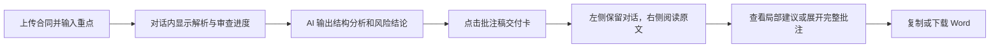

# 合同审核与批注工作台：可复用界面设计方案

> 适用场景：合同审查、制度/政策文件核对、尽调材料审阅、标书修订、报告校改等“上传文档 → AI 分析 → 原文定位 → 给出修改建议”的专业文档任务。
>
> 目标：复用法飞飞当前的克制、文档优先的 AI 工作台体验；不要做成仪表盘，也不要把修订结果退化为一长串脱离原文的风险卡片。

## 1. 一句话设计定义

一个以 **对话驱动任务**、以 **原文就近批注** 为最终交付物的专业 AI 文档审阅工作台。

用户先在聊天中上传合同、给出审查视角并看到过程；当 AI 完成后，再在同一任务上下文中打开“批注稿”。批注稿保留原文阅读节奏，只高亮最小问题片段，并把建议紧贴在对应位置下方。

## 2. 必须保留的体验原则

1. **原文是主角。** 结果必须回到合同原文的具体位置，不能只列风险清单。
2. **先总览、后细节。** 对话先给分析与风险结论；文档内默认展示短建议，原片段、风险说明、完整修订条款按需展开。
3. **局部而非整段。** 仅标记真正有问题的子句；避免整行、整条条款涂色或波浪线。
4. **一处一号、就近对应。** 原文标记和下方建议卡共用编号，用户无需在页面两端来回找。
5. **克制的专业感。** 白底、灰色分隔、深灰文字，橙色只用于风险定位与进行中状态；风险颜色只用于语义，不作为大面积装饰。
6. **过程可感知，但不打扰。** 用逐轮进度和流式文本说明 AI 正在做什么，避免全屏加载遮罩。
7. **长文可读。** 宽松行距、固定输入区、独立滚动区、默认折叠冗长信息。

## 3. 信息架构与状态

### 3.1 页面结构

```text
合同审核工作台（100vh）
├─ 历史侧栏（默认桌面显示，可折叠）
│  ├─ 搜索
│  ├─ 品牌 / 新对话 / 新审查任务
│  ├─ 历史对话列表
│  ├─ 审查任务列表（可选）
│  └─ 账户 / 用量入口
├─ 对话列（默认主列；展开文档后变为左列）
│  ├─ 顶部栏：返回、任务标题、免责声明
│  ├─ 可滚动的对话内容
│  │  ├─ 欢迎说明与推荐问题
│  │  ├─ 用户指令 / 已上传文件
│  │  ├─ AI 分析与风险报告（Markdown）
│  │  ├─ 审查轮次进度面板
│  │  └─ “打开批注稿”交付卡
│  └─ 底部悬浮输入器：上传、模式选择、更多、发送
└─ 批注文档列（仅在打开批注稿后出现）
   ├─ 顶部栏：复制、下载 Word、关闭
   ├─ 合同原文 + 行内风险标记 + 就近修订卡
   └─ 文末统计与阅读说明
```

### 3.2 三个关键状态

| 状态 | 画面 | 目的 |
| --- | --- | --- |
| 初始 / 对话态 | 侧栏 + 居中宽对话列 | 快速提交合同与审查重点，降低空白页压力 |
| 审查进行中 | 对话态内出现阶段文本与轮次面板 | 让长任务可解释，允许用户保留上下文或切换任务 |
| 批注展开态 | 隐藏侧栏；左侧窄对话列 + 右侧大文档列 | 同时保留“为什么改”和“具体改哪里” |

展开态推荐比例：对话列 `38%`（最小 420px），文档列占余下空间；中等屏幕可改为 `42%`（最小 360px）。移动端切换为全屏文档，保留明确的关闭按钮返回对话。

## 4. 视觉系统（可直接复用）

### 4.1 设计令牌

| 语义 | 推荐值 | 用法 |
| --- | --- | --- |
| 页面正文 | `#161616` | 标题、正文、主要操作 |
| 次级文字 | `#9A9A9E` | 提示、时间、位置、辅助说明 |
| 分割线 | `#ECECEC` | 顶栏、卡片和侧栏边界 |
| 浅背景 | `#F7F7F8` | 侧栏、推荐问题、弱化区域 |
| 品牌 / 中风险 | `#FD7002` | 定位下划线、处理中、普通风险 |
| 高风险 | `#C0392B` | 高风险标签、左边线、编号 |
| 低风险 | `#B8860B` | 低风险标签、左边线、编号 |
| 深色主操作 | `#202024` | 圆形发送按钮、重要确认操作 |

- 字体：`Inter, -apple-system, BlinkMacSystemFont, PingFang SC, Microsoft YaHei, sans-serif`。
- 页面正文 16px / 1.82；合同正文 16px / 1.95；文档标题 27–43px；工具文字 12–14px。
- 圆角：输入器 24px，主要卡片 14–16px，小型列表和标签 8–10px。
- 阴影：只在悬浮输入器、选中历史项和浮层使用轻阴影；正文和普通卡片以边框区隔。

### 4.2 版式尺度

- 侧栏：286px，16px 内边距；窄屏时 230px。
- 顶栏：76px；移动端 64px。
- 对话内容最大宽度：860px，底部预留约 162px，避免被输入器遮挡。
- 文档正文最大宽度：980px；展开态文档滚动区横向留白为 `clamp(45px, 7vw, 120px)`。
- 输入器：最大宽度 860px，最小高度 118px，固定在当前对话列底部而不是浏览器全宽。

## 5. 组件规范

### 5.1 对话与任务入口

**侧栏**：浅灰底，搜索框、两个主动作（新对话 / 新审查任务）、可搜索的历史列表与账户入口。选中项白底、极轻阴影；正在处理的任务将图标变为橙色加载态，不允许删除。

**对话头部**：任务名称居中，下一行使用 11px 灰字展示“AI 生成内容仅供参考，请结合实际情况判断”。不要放置密集的图标工具栏。

**用户消息**：右对齐、最大宽度 78%、浅灰气泡。附件紧随气泡，单独以细边框文件条展示文件名和大小。

**AI 消息**：左对齐、没有头像气泡，直接使用排版良好的 Markdown 文本；这样可以让审查结果像专业意见书，而不是客服聊天。

**交付卡**：AI 完成后在对话内出现可点击的文件卡，包含蓝色文档图标、标题“商业合同审查批注稿”、问题数 / 就近标记数和“点击展开文档”。这是从“分析”进入“可执行成稿”的唯一主入口。

### 5.2 输入器

输入器悬浮于对话列底部，上方使用渐变白底与内容分离。结构如下：

```text
多行文本框：上传合同或输入特别关注的审查重点…
已选文件标签（可移除）
上传按钮 | 分隔线 | 快速 / 深度思考分段控件 | 更多          圆形发送按钮
```

- 支持 `Cmd/Ctrl + Enter` 发送。
- 发送按钮无内容时使用浅灰禁用态；可发送时为深色圆形。
- “快速 / 深度思考”是模型策略而非风险等级，视觉上用中性灰分段控件表达。

### 5.3 三轮审查进度面板

该面板嵌在 AI 消息内，避免中断聊天流。面板顶部展示“3/3 轮完成 · 累计发现 N 条问题”；内部固定三个轮次：首轮审查、二轮复审、三轮复审。

- 已完成：绿色圆形编号和绿色状态文字。
- 进行中：橙色圆形编号和旋转加载图标。
- 未开始：灰色、约 55% 透明度。
- 每轮可展开其新增问题：风险等级标签、问题标题、位置、风险摘要。高/中/低风险分别使用柔和红/橙/黄底，不使用高饱和整块背景。

### 5.4 原文行内批注（核心组件）

**可靠定位的修改**采用“行内标记 + 局部修订卡”：

```text
合同原句：……[最小问题子句]①……

①  改为  建议替换后的最小文本
   查看批注与完整修订条款 ▾
```

- 原文标记：透明到 54% 的橙色渐变底 + `1.5px` 橙色下划线 + 上标圆形编号；绝不整条涂色。
- 修订卡：距原文左侧缩进约 22px，白橙底、细边框、10px 圆角；编号与标记一致。
- 卡片第一行只呈现操作词（`改为` / `删除此处` / `在此后补充`）与建议文本。
- 折叠区依次放置：原片段、说明、完整条款。默认折叠，避免长合同被建议淹没。
- 高/中/低风险只改变编号、边框和底色的轻微色相，保留统一结构。

**没有可靠原文锚点的修改或新增条款**采用“紧凑修订卡”：

- 不伪造行内高亮；卡片挂在可信插入锚点之后。
- 左边线表达操作类型：实线=修订、虚线=新增、双线=删除。
- 展示“新增 / 修订 / 删除 + 标题 + 两行建议预览”，完整修订与批注折叠。

### 5.5 文档列与文末说明

文档列头部只保留：`复制`、`下载 Word`、`关闭`。正文使用接近阅读器的留白，不加页码、花哨纸张纹理或大量工具条。

文末使用浅灰统计条，例如：

> 12 个问题，生成 9 个就近修订标记（修订 6 · 新增 2 · 删除 1）。正文中的浅橙色片段和编号对应下方局部修改；完整修订条款与批注默认收起，可按需展开查看。

## 6. 交互与数据规则

### 6.1 用户路径



### 6.2 前端最小数据模型

不要只接收一段 HTML 或 Markdown。要渲染可追溯批注，接口至少返回：

```ts
type ReviewFinding = {
  findingId: string
  level: 'high' | 'mid' | 'low'
  title: string
  riskNote?: string
  lineStart: number
  lineEnd: number
  quoteText?: string
  quoteSpans?: Array<{ line: number; start: number; end: number }>
}

type LocalizedEdit = {
  editId: string
  operation: 'replace' | 'delete' | 'insert-after'
  targetQuote?: string
  replacementText?: string
  lineStart?: number
  lineEnd?: number
  insertAfterLine?: number
  quoteSpans?: Array<{ line: number; start: number; end: number }>
}

type Revision = {
  findingId: string
  action: 'modify' | 'add' | 'delete'
  title: string
  level: 'high' | 'mid' | 'low'
  anchorText?: string
  rewrittenText?: string
  riskNote?: string
  localizedEdits?: LocalizedEdit[]
}
```

渲染规则：只有 `quoteSpans` 通过后端/本地校验且能定位到原文时，才做行内高亮；定位失败时降级为紧凑修订卡。一个 finding 对应一个编号，统计按 finding 计数、展示块数单列，避免“发现 3 个问题却只显示 1 个新增块”造成误解。

## 7. 响应式与可访问性底线

- `<= 760px`：隐藏侧栏；批注稿打开后以全屏文档替代双列，保留顶部关闭按钮；正文左右 22px 留白。
- 触摸设备：所有图标按钮至少 36px 命中区域；折叠标题可点击；不依赖 hover 才能触达删除或详情。
- 所有仅图标按钮必须有 `aria-label` 与 tooltip；发送、上传、复制、下载、关闭要可用键盘访问。
- 长文本必须 `word-break: break-word`；文件名称和会话名称用省略号处理。
- 长任务过程中，用户上滑阅读时停止自动滚动；回到底部附近才恢复自动跟随。

## 8. 可直接发送给 AI 的界面实现指令

将下面模板中的方括号替换后，直接交给 AI 设计或前端编码工具：

```text
请为「[产品名]」设计并实现一个桌面优先的 [文档类型] AI 审阅工作台，
使用“对话驱动任务 + 原文就近批注”的界面，而不是仪表盘或单独的风险列表页。

核心流程：用户上传文件并输入审阅重点；AI 在对话中流式展示分析、阶段进度和分轮发现；完成后在聊天记录内给出一个可点击的“批注稿”交付卡。点击后进入双列状态：左侧保留窄对话列，右侧为宽文档阅读列。右侧必须保留原文结构，仅在可信的最小问题子句上使用浅橙色半透明底、细橙色下划线和上标编号；在该原文行下方紧贴展示同编号的局部修订卡。局部修订卡默认只展示“改为/删除此处/在此后补充 + 短建议”，原片段、原因和完整修订内容放进折叠详情。

视觉风格：克制的专业文档工具。白色主背景、#F8F8F9 浅灰侧栏、#ECECEC 分割线、#161616 文字、#9A9A9E 辅助文字、#FD7002 作为唯一品牌强调。高/中/低风险使用柔和的红/橙/黄，只用于小标签、编号和细边框。使用系统无衬线中文字体，合同正文 16px/1.95，宽松留白。不要使用渐变大背景、玻璃拟态、彩色仪表盘、过多阴影、头像气泡或大面积风险色块。

精确尺寸：侧栏 286px；顶部栏 76px；对话列内容最大 860px；底部输入器最大 860px、高约 118px、固定在对话列底部；展开批注稿后左侧对话列约 38% 且最小 420px，右侧文档正文最大 980px。移动端隐藏侧栏，批注稿改为全屏文档。

请输出可运行的 [React + CSS / 目标技术栈] 页面，包含：历史对话侧栏、固定输入器、文件标签、快速/深度思考切换、三轮审查进度面板、批注稿交付卡、双列批注稿、局部高亮、局部修订卡、无定位新增/删除的紧凑修订卡、复制/下载/关闭操作、空态、加载态和错误态。数据结构应支持 findingId、风险级别、原文行号、字符范围 quoteSpans、局部编辑 localizedEdits 和完整修订内容；只有 quoteSpans 有效时才高亮原文，不能伪造定位。
```

## 9. 快速验收清单

- [ ] 用户可在一个页面内完成上传、提出重点、查看进度、看结论与打开批注稿。
- [ ] 批注稿展开后仍可看到对应对话上下文。
- [ ] 每一个原文编号能对应到紧邻的建议卡，且编号唯一。
- [ ] 只高亮问题子句，不高亮整条条款；定位失败时不高亮。
- [ ] 完整修订条款与风险说明默认折叠。
- [ ] 新增、修改、删除可被一眼区分，但风险色不喧宾夺主。
- [ ] 长合同阅读顺畅，输入器不遮挡内容，移动端有完整返回路径。
- [ ] 下载稿保留页面中的编号、局部高亮与就近批注语义。

## 10. 本项目的实现映射

- 页面与状态管理：`src/pages/ContractRewritePage.jsx`
- 视觉令牌、布局、批注卡与响应式：`src/pages/ContractRewritePage.css`
- 设计验收记录：`design-qa.md`
- 产品与数据可信边界说明：`README.md`

后续项目优先复用“信息架构、组件职责、数据边界和验收清单”；品牌名、文案、领域术语、审查轮数、导出格式与风险规则则替换为新项目配置。
